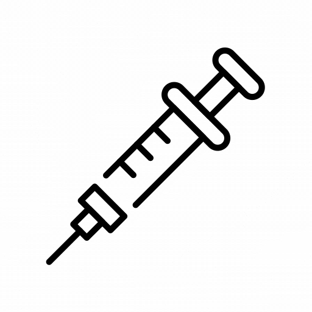

# 🛡️ SQL Injection Demo Project 💥



## 🚀 Project Description

This project is a **hands-on demonstration** designed to illustrate the **SQL Injection vulnerability** and how to **prevent it** using secure coding practices. 🧑‍💻 It simulates a simple product search application that interacts with a SQLite database.

**Key Objectives:**

*   Understand what SQL Injection is and how it works. 🤔
*   Observe a **vulnerable query** being exploited through SQL injection. 😈
*   See how a **safe query** (using parameterized queries) effectively prevents SQL injection. ✅
*   Learn the importance of secure database interaction in web applications. 🔒

**⚠️ Important Ethical Note:** This project is strictly for **educational purposes**.  **Never attempt to perform SQL injection or any other form of hacking on systems you do not own or have explicit permission to test.** Unauthorized security testing is illegal and unethical. This project should only be used in a controlled, local environment.

## 🔍 What is SQL Injection?

Imagine your application is like a translator 🗣️ between the user and a database 🗄️.  When a user searches for something, your application creates an SQL query (a question in the database's language) and sends it to the database to get the answer.

**SQL Injection** is like tricking the translator into adding extra, malicious instructions to the question. 😈 If your application is not careful about how it builds these SQL questions, an attacker can sneak in their own SQL code through user input. This injected code can then:

*   **Bypass security checks** 🚪🚫
*   **Access sensitive data** 🔑🤫
*   **Modify or delete data** 📝🗑️
*   In severe cases, even **take control of the database server** 🤯

**It's like leaving the door🚪 unlocked and inviting the intruder 🦹‍♂️ in to do whatever they want with your valuable data!**

## 🧪 Vulnerable Query vs. Safe Query

This project highlights the difference between two ways of constructing SQL queries:

### 😈 Vulnerable Query (`fetch_product_by_name` in `db_utils.py`)

This query is **susceptible to SQL Injection** because it **directly embeds user input into the SQL query string** using f-strings:

```python
query = f"SELECT * FROM products WHERE name = '{product_name}'"
cursor.execute(query)
```

# SQL Injection Vulnerability Demo: Direct vs. Parameterized Queries

This project demonstrates a common web application vulnerability: **SQL Injection**, and showcases how to prevent it using **parameterized queries**.

## Understanding SQL Injection

**SQL Injection** occurs when user-provided input is directly embedded into SQL queries without proper sanitization. This allows attackers to inject malicious SQL code, potentially leading to data breaches, data manipulation, or unauthorized access.

### Direct Embedding (Vulnerable)

In a vulnerable application, user input is directly inserted into the query string.

**Example of Vulnerability:**

Consider a scenario where you search for products by name.  If the application uses direct embedding, a query might look like this:

```sql
SELECT * FROM products WHERE name = '<user_input>';
```

If a malicious user enters a payload like ' OR '1'='1 in the search bar, the query becomes:

```sql
SELECT * FROM products WHERE name = '' OR '1'='1';
```

**Example of Vulnerability:**

Imagine a product search feature where you enter a product name. If the system uses direct embedding, a specially crafted input can alter the intended query logic. For example, entering a specific payload can manipulate the query to bypass the intended search conditions and retrieve all product information, regardless of the search term. This happens because the injected SQL code changes the query's behavior in unintended ways.

This vulnerability occurs because the system mistakenly trusts user input as legitimate instructions rather than just data.

### Parameterized Queries: The Safe Approach

**Parameterized queries**, also known as prepared statements, are the recommended technique to protect against SQL injection. This method uses placeholders within the SQL query to represent user input.  Crucially, the user input is then passed to the database as separate parameters, distinct from the SQL code itself.

**Key Features of Safe Queries:**

- **Placeholders:** The SQL query uses symbols as placeholders where user input should be inserted.
- **Separate Parameters:** User input is sent to the database execution function as distinct parameters, not as part of the SQL command string.
- **Treating Input as Data:** The database system interprets these parameters purely as data values, not as executable SQL code. This separation is the core of the protection mechanism, effectively neutralizing injection attempts.

**Example of Safety:**

When using parameterized queries, even if a user enters a malicious payload designed to inject SQL code, the database system treats it as a literal search term.  Instead of executing the injected code, the system searches for a product name that literally matches the entire malicious input string.  In most cases, this will result in no products being found, as the system safely handles the input as data, not code.

The use of parameterized queries is like installing a robust security lock, ensuring that only authorized data requests are processed and that malicious SQL commands cannot be injected through user inputs.

```python
# Safe from SQL Injection using parameterized query
def fetch_product_by_name_safe(cursor, product_name):
    query = "SELECT * FROM products WHERE name = ?"  # Placeholder ?
    cursor.execute(query, (product_name,))  # Pass user input as a parameter
    return cursor.fetchall()
```

## 📂 Project Directory Structure

The project is organized into the following directories and files:
```
sql_injection_demo/  (Project Root Directory - you can name it as you like)
├── db/
│   └── products.db       (SQLite database file - contains product data)
├── src/
│   ├── db_utils.py      (Module for database interaction - contains vulnerable and safe queries)
│   ├── app.py           (Command-line application - demonstrates SQL injection in terminal)
│   ├── streamlit_app.py (Streamlit web application - user-friendly interface for demo)
│   └── setup_db.py      (Script to create and populate the database with sample data)
├── README.md           (This file - project documentation)
└── requirements.txt      (Lists project dependencies - currently empty as we only use standard Python library)
```


## ⚙️ Commands to Run the Project

**Prerequisites:**

- Python 3.x must be installed on your system.
- For the web application demo, Streamlit needs to be installed. You can install it using pip: `pip install streamlit`.

**1. Setup the Database (Initial Setup)**

If you haven't set up the database already, follow these steps:

1.  Open your terminal or command prompt.
2.  Navigate to the `src` directory within the project directory.
3.  Execute the database setup script to create the database and populate it with data.

This process will create the `db` directory and the `products.db` file containing sample product data in the project's root directory.

**2. Run the Command-Line Application (Terminal Demo)**

1.  Navigate to the `src` directory in your terminal.
2.  Run the command-line application script.
3.  Follow the prompts in your terminal to search for products and experiment with SQL injection payloads.

**3. Run the Streamlit Web Application (User-Friendly Demo)**

1.  Navigate to the root directory of the project in your terminal.
2.  Run the Streamlit application script.
3.  This will automatically open the application in your web browser, typically at `http://localhost:8501`. You can then use the web interface to search for products and test SQL injection payloads in a more interactive way.

## 🧪 Testing SQL Injection

Once either the command-line or Streamlit application is running, you can test for SQL injection vulnerabilities by entering different inputs in the search prompt or text box.

**Experiment with these payloads in the search bar to observe the vulnerability:**

- **Normal Search:** Enter a valid product name like "Laptop". Observe the application's normal search behavior.
- **Bypass WHERE Clause:** Enter the payload `' OR '1'='1`. Observe how the vulnerable query might list all products, while the safe query remains secure and likely returns no results.
- **Bypass with Comment:** Try the payload `Laptop' OR 1=1 --`. This is another technique to bypass the intended query logic.

Pay close attention to the results displayed under the "Vulnerable Query Results" and "Safe Query Results" sections in the applications. By comparing these results, you can clearly see the impact of SQL injection and the protection provided by parameterized queries.

## 📚 Learn More

To deepen your understanding of SQL Injection and its prevention, consider exploring these resources:

- **OWASP SQL Injection:** [https://owasp.org/www-community/attacks/SQL_Injection](https://owasp.org/www-community/attacks/SQL_Injection)
- **SQL Injection Prevention Cheat Sheet:** [https://cheatsheetseries.owasp.org/cheatsheets/SQL_Injection_Prevention_Cheat_Sheet.html](https://cheatsheetseries.owasp.org/cheatsheets/SQL_Injection_Prevention_Cheat_Sheet.html)